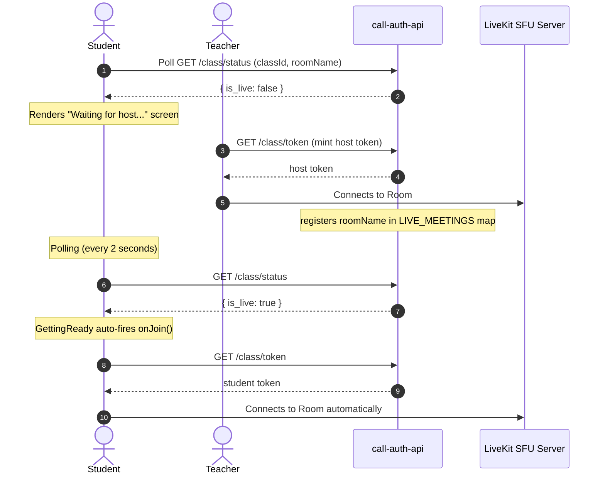

# 🌐 WebRTC Topology & Call Flow Architecture Guide

This document details the architectural design, WebRTC network topology, and runtime communication flows of the **Optimus** platform. It provides a comprehensive explanation of how data, media, and authorization flow across the client, backend API, databases, and LiveKit WebRTC media server.

---

## 📡 WebRTC Network Topology: SFU Architecture

Optimus is built on **LiveKit**, which implements a centralized **Selective Forwarding Unit (SFU)** topology. It is neither a decentralized peer-to-peer (Mesh) system nor a pure mixing relay (MCU).

```mermaid
graph TD
    subgraph SFU Topology (Selective Forwarding Unit)
        C1[Student Client 1] -- Publish Stream (Audio/Video) --> Server[LiveKit SFU Server]
        C2[Student Client 2] -- Publish Stream (Audio/Video) --> Server
        Teacher[Teacher Client] -- Publish Stream (Audio/Video) --> Server
        
        Server -- Forward Stream 1 & 2 --> Teacher
        Server -- Forward Teacher Stream --> C1
        Server -- Forward Teacher Stream --> C2
    end
    
    style Server fill:#1e1b4b,stroke:#a78bfa,stroke-width:2px;
```

### 🔍 Comparison of WebRTC Topologies

| Feature | Mesh (Decentralized P2P) | MCU (Centralized Mixer) | SFU (Optimus/LiveKit) |
| :--- | :--- | :--- | :--- |
| **Relay Method** | Direct peer-to-peer connection | Central mixer decodes, merges, and encodes | Central router forwards packets without decoding |
| **Client Upload** | High ($O(N)$ copies sent to each peer) | Low (1 copy sent to server) | Low (1 copy sent to server) |
| **Server CPU Load** | None (no central server) | Extremely high (decoding/encoding) | Low (only routing RTP packets) |
| **Scale Limit** | ~4-6 participants | ~50+ (costly hardware required) | **5,000+ concurrent users** |
| **E2EE Support** | Native | Impossible (server must decode) | **Fully Supported** (via Insertable Streams) |
| **Access Control** | Peer-enforced (unsafe) | Server-enforced (safe) | **Server-enforced (highly secure)** |

### 🛡 Why SFU is critical for Optimus:
1. **Server-Side Authorization**: Students cannot bypass rules because the LiveKit server strictly validates tokens signed by the `call-auth-api` secret. If a student tries to join an inactive class, the token request is rejected.
2. **Bandwidth Optimization**: Students upload their video/audio only once, and the SFU forwards it.
3. **E2EE**: Supports End-to-End Encryption where keys are known only to participants, while the SFU handles media routing blindly.

---

## 🔄 Core Runtime Flow Diagrams

### 1. Authentication & Scoped Token Exchange Flow
This flow ensures that students can only join rooms if they are enrolled, the meeting is scheduled, and the host is present.

```mermaid
sequenceDiagram
    autonumber
    actor Student
    participant AuthAPI as call-auth-api
    participant Dynamo as DynamoDB (Consistent Read)
    participant LiveKit as LiveKit SFU Server

    Student->>AuthAPI: GET /class/token (classId, roomName)
    Note over AuthAPI: Consistent read checks
    AuthAPI->>Dynamo: GetItem (Verify Enrollment)
    Dynamo-->>AuthAPI: active / enrolled
    AuthAPI->>Dynamo: GetItem (Verify Schedule Window)
    Dynamo-->>AuthAPI: valid time window

    alt is Student & Host is NOT Live
        AuthAPI-->>Student: HTTP 403 (host_has_not_started)
    else is Faculty OR (Student & Host IS Live)
        Note over AuthAPI: Mint LiveKit AccessToken JWT
        Note over AuthAPI: Contains userId, role, publish/subscribe grants
        AuthAPI-->>Student: Return participantToken & serverUrl
        Student->>LiveKit: Connect using token
        LiveKit: Validates signature with API Secret
        LiveKit-->>Student: Join Room (Granted publishing/subscribing)
    end
```

---

### 2. Real-Time Auto-Join Flow
When a student lands on the pre-join lobby before the teacher starts the class, they are placed in a waiting state. Once the teacher joins, the student client automatically connects in real-time.



---

### 3. Isolated Kick-out Flow
When the teacher removes a student, the student is instantly disconnected, while the teacher and other participants remain in the room uninterrupted.

```mermaid
sequenceDiagram
    autonumber
    actor Teacher
    actor Student
    participant AuthAPI as call-auth-api
    participant LiveKit as LiveKit SFU Server

    Teacher->>LiveKit: Broadcasts DataChannel { type: 'KICK_USER', targetIdentity: 's001' }
    Note over Student: Receives KICK_USER event
    Student->>LiveKit: Disconnects locally
    
    Teacher->>AuthAPI: POST /api/room/kick { roomName, identity: 's001' }
    AuthAPI->>LiveKit: removeParticipant(roomName, 's001')
    LiveKit: Server-side terminates session for 's001'
    
    Note over Student: Executed room.disconnect()
    Note over Student: ONLY student leaves, redirected to dashboard
    Note over Teacher: Remains connected in WebRTC room (uninterrupted)
```

_Note: In the fixed implementation, the student's local disconnection does NOT trigger `END_CALL_EVERYWHERE` or call `/api/room/end`, ensuring the teacher's session is isolated and unaffected by student exits._
